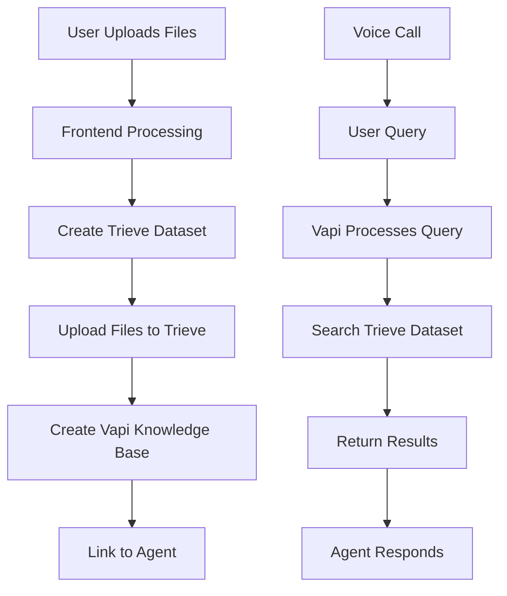

# Knowledge Base Architecture

## Overview

This document explains the current knowledge base approach for the Easy Agents Conversational AI Voice Agent system. The system uses a combination of Trieve for document storage and search, and Vapi for voice agent integration.

## Architecture Flow



## Components

### 1. Trieve Integration

Trieve is used as the primary knowledge storage and retrieval system. It provides:
- Semantic search capabilities
- Full-text search
- Hybrid search options
- Chunk-based document storage

### 2. Vapi Integration

Vapi acts as the bridge between the voice agent and the knowledge base:
- Imports Trieve datasets as knowledge bases
- Handles query processing during voice calls
- Manages search parameters (topK, scoreThreshold, etc.)

### 3. Database Schema

The system stores references to both Trieve and Vapi resources:

```sql
-- agents table columns
trieve_dataset_id: text  -- Trieve dataset ID
vapi_knowledge_base_id: text  -- Vapi knowledge base ID
knowledge_ids: text[]  -- Legacy knowledge base references
```

## Workflow

### 1. Knowledge Base Creation

When a user uploads knowledge documents:

1. **File Processing**: Files are read and prepared on the frontend
2. **Trieve Dataset Creation**: A new dataset is created in Trieve via the `create-trieve-dataset` edge function
3. **Document Upload**: Files are uploaded to Trieve as chunks via the `upload-to-trieve` edge function
4. **Vapi Knowledge Base**: A Vapi knowledge base is created that imports the Trieve dataset
5. **Agent Update**: The agent record is updated with both Trieve and Vapi IDs

### 2. Knowledge Retrieval

During a voice call:

1. User asks a question
2. Vapi processes the query
3. Vapi searches the linked Trieve dataset
4. Results are returned based on search configuration
5. Agent formulates a response using the retrieved information

## Edge Functions

### create-trieve-dataset
- Creates a new dataset in Trieve
- Requires: `TRIEVE_API_KEY` and `TRIEVE_ORG_ID`
- Returns: Dataset ID and metadata

### upload-to-trieve
- Uploads files as chunks to a Trieve dataset
- Supports multiple file uploads
- Adds metadata and tags to chunks
- Returns: Upload status for each file

### create-vapi-knowledge-base
- Creates a Vapi knowledge base using Trieve import
- Configures search parameters
- Links to agent record
- Returns: Knowledge base ID

## Configuration

### Environment Variables

```bash
# Trieve Configuration
TRIEVE_API_KEY=your_trieve_api_key
TRIEVE_ORG_ID=your_trieve_organization_id

# Vapi Configuration
VAPI_API_KEY=your_vapi_api_key
```

### Search Configuration

The system supports configurable search parameters:

- **Search Type**: `semantic`, `fulltext`, or `hybrid`
- **Top K**: Number of results to return (default: 3)
- **Score Threshold**: Minimum relevance score (default: 0.7)
- **Remove Stop Words**: Filter common words (default: true)

## Frontend Integration

The knowledge base UI is integrated into the agent settings:

1. **File Upload**: Users can upload multiple text files
2. **Search Configuration**: Users can configure search parameters
3. **Status Display**: Shows active knowledge base status
4. **One-Click Creation**: Simplified workflow for creating knowledge bases

## Benefits

1. **Scalability**: Trieve handles large document sets efficiently
2. **Search Quality**: Advanced semantic and hybrid search capabilities
3. **Flexibility**: Easy to update and manage knowledge bases
4. **Integration**: Seamless integration with Vapi voice agents
5. **Performance**: Optimized chunk-based retrieval

## Future Enhancements

1. **Document Management**: UI for viewing/editing uploaded documents
2. **Analytics**: Track which knowledge is most frequently accessed
3. **Multi-format Support**: Expand beyond text files (PDF, DOCX, etc.)
4. **Version Control**: Track changes to knowledge bases over time
5. **Collaborative Editing**: Allow team members to contribute to knowledge bases

## Troubleshooting

### Common Issues

1. **Upload Failures**: Check file size and format
2. **Search Not Working**: Verify Trieve dataset ID is correct
3. **API Errors**: Ensure environment variables are set correctly
4. **Performance Issues**: Consider adjusting chunk size and search parameters

### Debug Steps

1. Check Supabase Edge Function logs
2. Verify Trieve dataset exists and contains data
3. Test Vapi knowledge base directly via API
4. Review agent configuration in database

## API Reference

### Create Trieve Dataset
```typescript
POST /functions/v1/create-trieve-dataset
{
  "name": "dataset-name",
  "agent_id": "agent-uuid"
}
```

### Upload to Trieve
```typescript
POST /functions/v1/upload-to-trieve
{
  "dataset_id": "trieve-dataset-id",
  "files": [
    {
      "name": "file.txt",
      "content": "file content",
      "type": "text/plain"
    }
  ]
}
```

### Create Vapi Knowledge Base
```typescript
POST /functions/v1/create-vapi-knowledge-base
{
  "name": "kb-name",
  "trieveDatasetId": "trieve-dataset-id",
  "agentId": "agent-uuid",
  "searchType": "semantic",
  "topK": 3,
  "scoreThreshold": 0.7
}
